#**SQL Project: World Bank IDA Statement Insights**

**Project description:** This is an introductory SQL project that goes through historical data for IDA Statement Of Credits, Grants and Guaranteesvfrom The World Bank Group. [The raw data used is available here](https://financesone.worldbank.org/ida-statement-of-credits-grants-and-guarantees-historical-data/DS00976). These queries were written in DB Browser for SQLite after turning the .csv from The World Bank Group into a database.


### 1. Returning the entire table

```sql
SELECT * FROM IDA_Statements;
```


### 2. Returning all records from table, but only the borrower & "Due to IDA" fields 

```sql
SELECT  Borrower, [Due to IDA (US$)] FROM IDA_Statements;
```

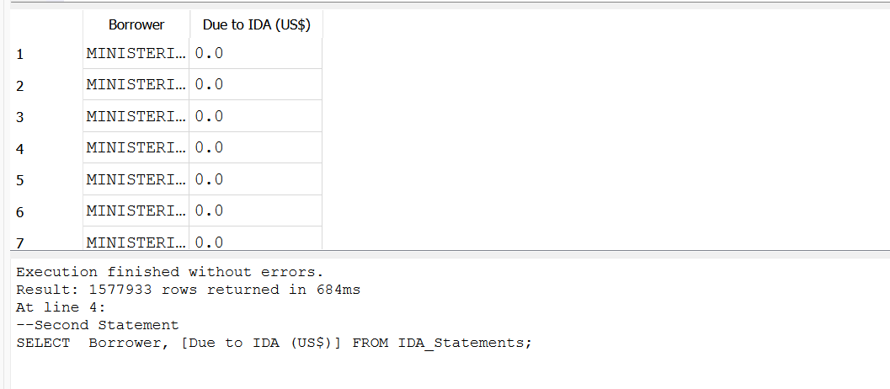

### 3. Limiting the above query to only five records 

```sql
SELECT  Borrower, [Due to IDA (US$)] FROM IDA_Statements LIMIT 5; 
```
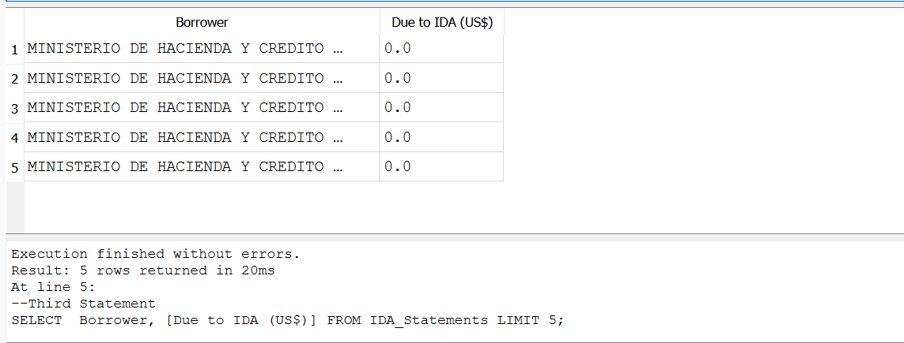

### 4. Created an alias for one field for clarity 

```sql
SELECT  Region, [Due to IDA (US$)] AS [Amount Due] FROM IDA_Statements LIMIT 20;
```
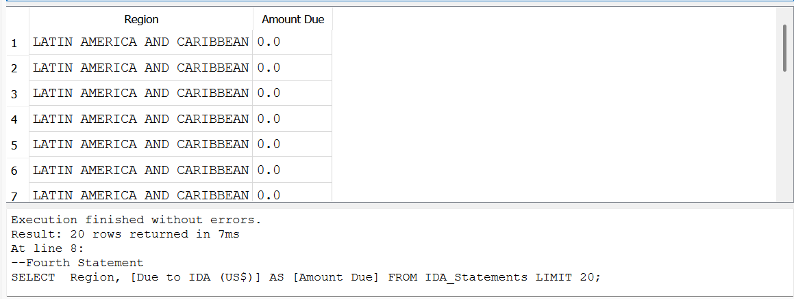


### 5. Pulling all records and all fields for Nicaragua only

```sql
SELECT * FROM IDA_Statements WHERE [Country / Economy] = 'Nicaragua';
```

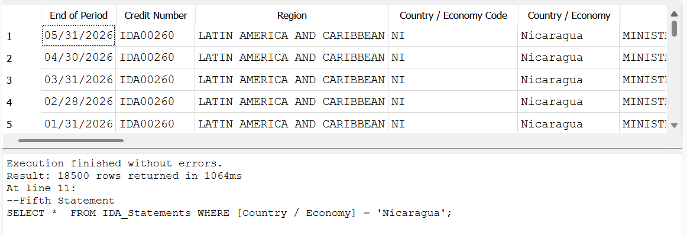

### 6. Pulling the total number of transactions for Nicaragua

```sql
SELECT COUNT([Due to IDA (US$)]) FROM IDA_Statements WHERE [Country / Economy] = 'Nicaragua';
```

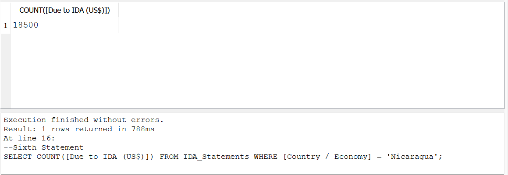

### 7. Pulling the total number of transactions by Country/Economy 

```sql
SELECT [Country / Economy], COUNT(*) FROM IDA_Statements GROUP BY [Country / Economy];
```

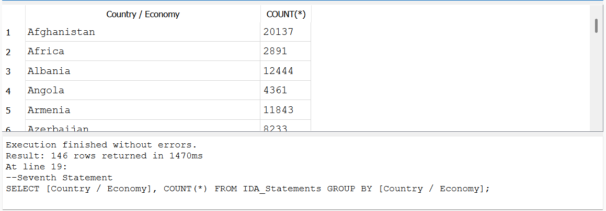

### 8. Querying the maximum amount owed to The World Bank Group

```sql
SELECT MAX([Due to IDA (US$)]) FROM IDA_Statements;
```
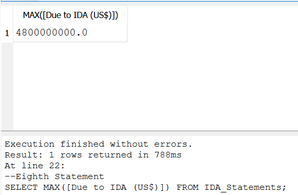

### 9. Querying the total amount owed to The World Bank Group

```sql
SELECT SUM([Due to IDA (US$)]) FROM IDA_Statements;
```
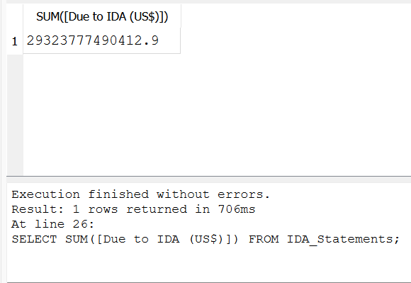

```sql
--Other ways to approach Ninth Statement Cumulative sum
--In Thousands
SELECT SUM([Due to IDA (US$)])/1000 AS (Due to IDA in Thousands) FROM IDA_Statements;
--In Millions
SELECT SUM([Due to IDA (US$)])/1000000 AS (Due to IDA in Millions) FROM IDA_Statements;
--In Billions
SELECT SUM([Due to IDA (US$)])/1000000000 AS (Due to IDA in Billions) FROM IDA_Statements;
```

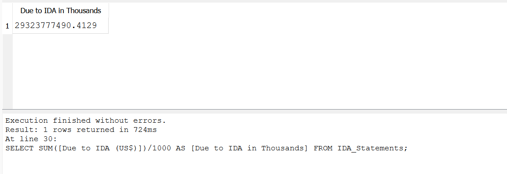
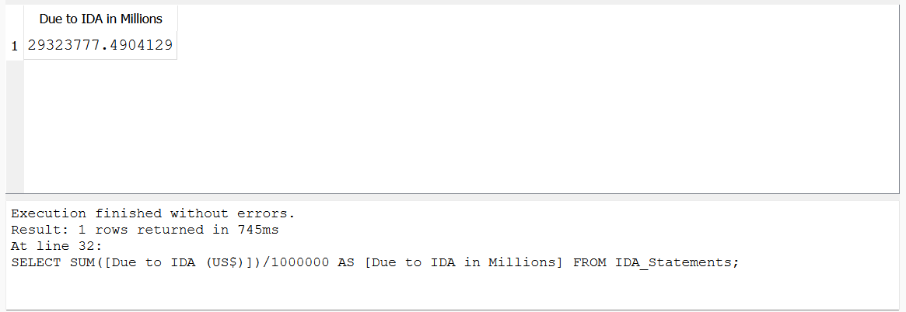
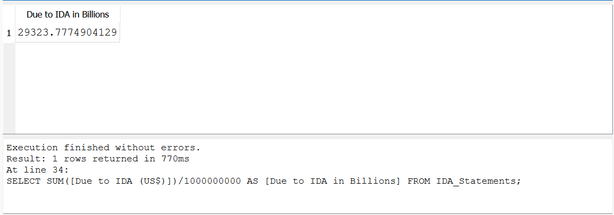


### 10. Querying the average service charge rate
```sql
SELECT AVG([Service Charge Rate]) AS [Average Service Charge Rate] FROM IDA_Statements;
```

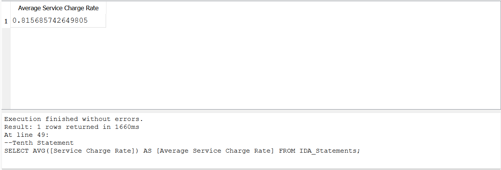


### 11. Selecting all records where there is a service charge rate (in ascending order)

```sql
SELECT * FROM IDA_Statements WHERE [Service Charge Rate] IS NOT NULL ORDER BY [Service Charge Rate] ASC;
```

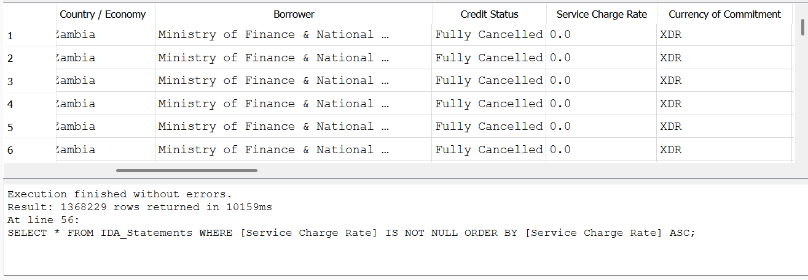

### 11. Selecting all transactions for Honduras with a service charge rate greater than 1

```sql
SELECT * FROM IDA_Statements WHERE [Country / Economy] = 'Honduras' AND [Service Charge Rate] > 1;
```


### 12. Selecting all transactions for Project Cotton or Project River

```sql
SELECT * FROM IDA_Statements WHERE [Project Name] = 'COTTON' OR [Project Name] = 'RIVER';
```
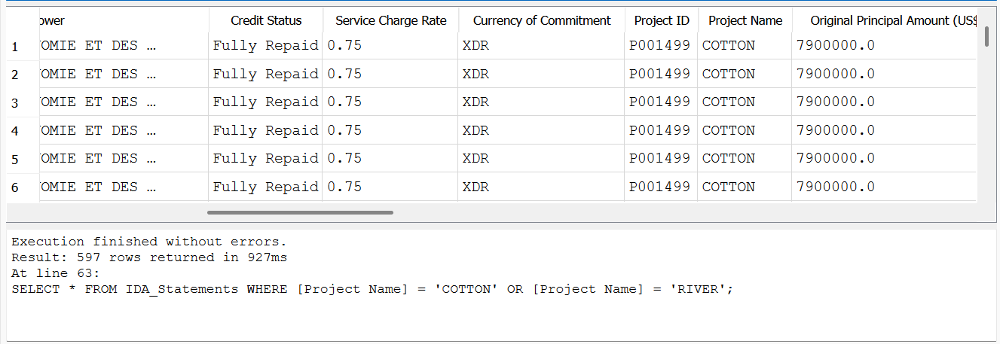


### 13. Selecting all transactions except for those from Project Cotton

```sql
SELECT * FROM IDA_Statements WHERE [Project Name] IS NOT 'COTTON';
```

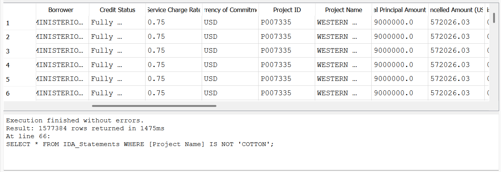

