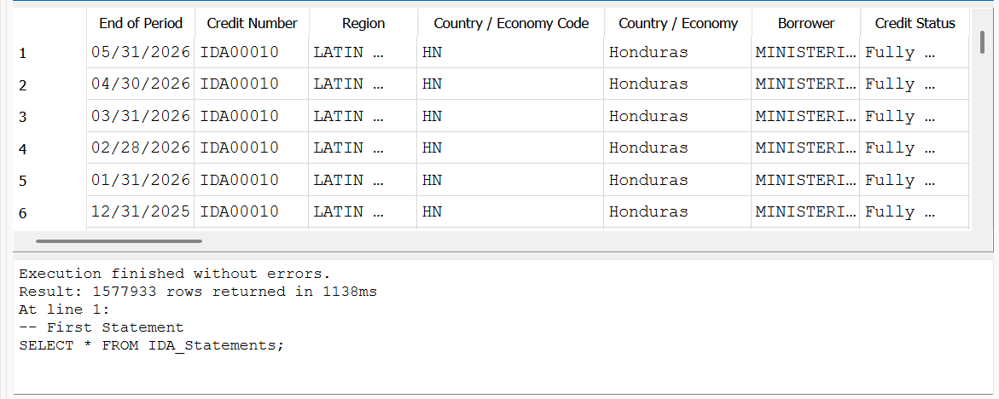

##SQL Project: World Bank IDA Statements

**Project description:** This is an introductory SQL project that goes through historical data for IDA Statement Of Credits, Grants and Guaranteesvfrom The World Bank Group. [The raw data used is available here](https://financesone.worldbank.org/ida-statement-of-credits-grants-and-guarantees-historical-data/DS00976). These queries were written in DB Browser for SQLite after turning the .csv from The World Bank Group into a database.


Show us all transactions from the Nicaragua (the country)?

How many total transactions? 

How many total transactions per country?? 

What is the max owed to the IDA?

Which was the most recent to pay?

Who has the most loans? 

### 1. Returning all of the table

```sql
SELECT * FROM IDA_Statements;
```



### 2. Returning all records from table, but only the borrower & "Due to IDA" fields 

```sql
SELECT  Borrower, [Due to IDA (US$)] FROM IDA_Statements; 
```
### 3. Limiting the above query to only five records 

```sql
SELECT  Borrower, [Due to IDA (US$)] FROM IDA_Statements LIMIT 5; 
```
### 4. Created an alias for one field for clarity 

```sql
SELECT  Region, [Due to IDA (US$)] AS [Amount Due] FROM IDA_Statements LIMIT 20;
```
### 5. Pulling all records and all fields for Nicaragua only

```sql
SELECT * FROM IDA_Statements WHERE [Country / Economy] = 'Nicaragua';
```
### 6. Pulling a 

```sql
SELECT COUNT([Due to IDA (US$)]) FROM IDA_Statements WHERE [Country / Economy] = 'Nicaragua';
```

```sql
SELECT [Country / Economy], COUNT(*) FROM IDA_Statements GROUP BY [Country / Economy];
```
```sql
SELECT MAX([Due to IDA (US$)]) FROM IDA_Statements;
```
```sql
SELECT SUM([Due to IDA (US$)]) FROM IDA_Statements;
```
```sql
--Other ways to approach Ninth Statement Cumulative sum
--In Thousands
SELECT SUM([Due to IDA (US$)])/1000 AS (Due to IDA in Thousands) FROM IDA_Statements;
--In Millions
SELECT SUM([Due to IDA (US$)])/1000000 AS (Due to IDA in Millions) FROM IDA_Statements;
--In Billions
SELECT SUM([Due to IDA (US$)])/1000000000 AS (Due to IDA in Billions) FROM IDA_Statements;
```

```sql
SELECT AVG([Service Charge Rate]) AS [Average Service Charge Rate] FROM IDA_Statements;
```

```sql
SELECT * FROM IDA_Statements WHERE [Service Charge Rate] IS NOT NULL ORDER BY [Service Charge Rate] ASC;
```

```sql
SELECT * FROM IDA_Statements WHERE [Country / Economy] = 'Honduras' AND [Service Charge Rate] > 1;
```

```sql
SELECT * FROM IDA_Statements WHERE [Project Name] = 'COTTON' OR [Project Name] = 'RIVER';
```

```sql
SELECT * FROM IDA_Statements WHERE [Project Name] IS NOT 'COTTON';
```


### 2. You can add any images you'd like. 


